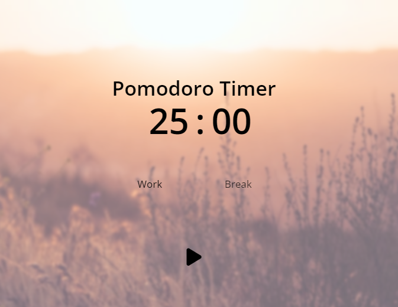

# Pomodoro Timer Project

    

This Pomodoro Timer project is a simple yet 
effective tool designed to help users manage 
their time more efficiently. Inspired by the 
Pomodoro Technique, the timer allows users 
to break their work into intervals, typically 
25 minutes long, separated by short breaks. 
With an intuitive interface, users 
can easily start the timer and switch between 
work and break modes with just a click. 
Whether you're studying, working, 
or tackling personal projects, this Pomodoro
Timer is a valuable companion for boosting 
productivity and maintaining a healthy 
work-life balance 👌😊. 

 
